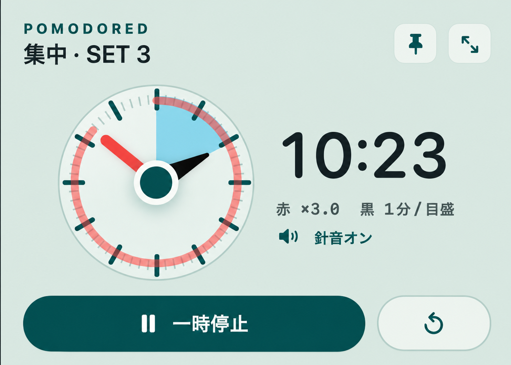
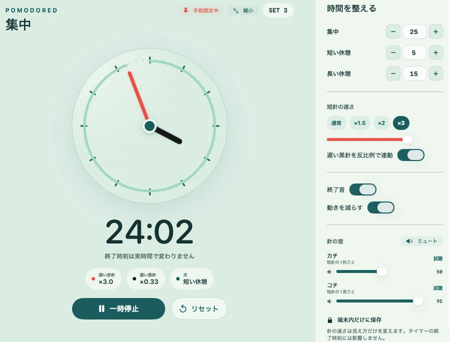
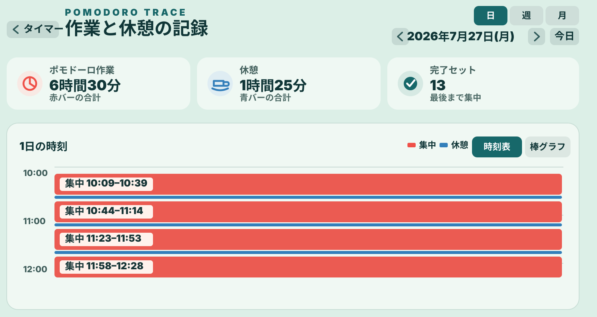
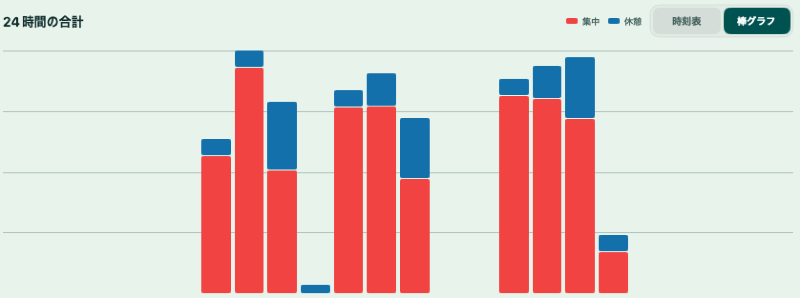
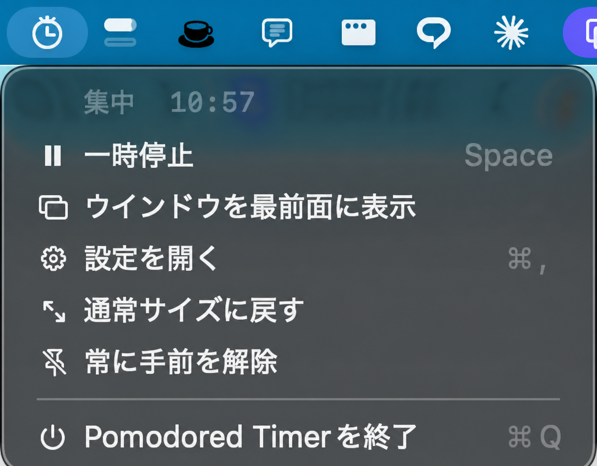

# Pomodored Timer Public

時計の針の動きで、集中時間の経過と残り時間を直感的に確認できるポモドーロタイマーです。

時計の表示速度と作業効率の関係を扱った研究に着想を得て、実際の終了時刻は変えずに、表示上の赤い針だけを速く動かせるようにしています。黒い針と半透明の扇形は実時間の残り時間を示すため、「表示上の時間の進み」と「実際の残り時間」を同時に確認できます。

## タイマー本体

赤い針は通常速度から最大5倍速まで変更できます。赤い針の速度を変えても、タイマーの終了時刻は変わりません。黒い針は実時間に合わせて動き、扇形は残り時間に合わせて縮みます。

集中中は、赤い針が表示上の1秒分進むたびに「カチ」、1周するたびに「コチ」と鳴ります。赤い針を速くすると音の頻度も上がります。休憩中は毎秒の針音を止め、1周ごとの音だけを鳴らします。



## ポモドーロのセッション管理

集中・短い休憩・長い休憩を設定できます。セッションは自動的には開始せず、「次のセッション」を押して切り替える方式です。作業を始める前に、取り組む内容を入力し、完了した集中時間だけを記録します。

設定できる時間は、集中10〜90分、短い休憩3〜30分、長い休憩3〜30分です。既定値は集中25分、短い休憩5分、長い休憩15分です。

## 時間と音を調整する設定画面

時間は「−」「＋」で1分ずつ変更でき、中央の数字をクリックして直接入力することもできます。赤い針の速度、針音、終了音を個別に設定・試聴でき、必要に応じてミュートできます。



## 作業記録を見返す

実際にタイマーを動かした集中時間を赤、休憩時間を青で記録します。日別の時刻表と、時間帯別の棒グラフで作業の偏りや合計時間を確認できます。一時停止中の時間は集中時間に加算しません。





## コンパクト表示と常に手前に表示

針の動きを確認できる通常表示に加えて、作業画面を広く使える約320×300の縮小表示へ切り替えられます。「常に手前」を有効にすると、ほかのウインドウに隠れない位置へ固定できます。

## メニューバーから操作する

macOSでは、画面上部のメニューバーから開始、一時停止、再開、設定画面の表示、タイマーの前面表示を操作できます。タイマー本体を閉じたり、ほかのウインドウの背面に移動したりしても、メニューバーからすぐに呼び戻せます。



## データの保存先

設定と活動記録は利用者の端末内だけに保存します。macOSとWindowsで保存領域を分離し、公開版は個人版の設定・履歴・登録URLを読み込みません。

## 主な操作

- `Space`：開始／一時停止／再開
- `Command + R`：現在のセッションを終了し、集中・SET 1・停止状態へ戻す
- 緑ボタン：通常表示と縮小表示を切り替える
- メニューバー／通知領域：タイマー操作、設定、前面表示
- 「常に手前」：ほかのウインドウより前に固定する

## 構成

```text
PomodoredTimer/
├── Sources/PomodoredTimer/         macOS公開版
├── Windows/                        Windows 11 x64公開版候補
├── Shared/TestVectors/             OS共通の挙動契約とテストデータ
├── Tests/                          macOSと共通仕様の検証
└── scripts/                        ビルド・公開境界の自動検査
```

この公開リポジトリには、個人版のソース、登録URL、実利用履歴、UserDefaults、ローカルパス、生成済み個人成果物を含めません。

## macOS版のビルド

必要環境：macOS 14以降、Swift 6、Xcode Command Line Tools。

```sh
./scripts/build-app.sh
```

検査済みアプリは `dist/public/Pomodored Timer Public.app` に生成されます。ビルド時に、公開版以外の保存キー、ローカルパス、履歴ファイル、ネットワークURL、WebKit依存が成果物へ混入していないことを検査します。

## Windows版候補のビルド

必要環境：Windows 11 x64、.NET 10 SDK。

```powershell
./scripts/build-windows-public.ps1
```

検査済み成果物は `dist/windows-public` に生成されます。Windows実機での受入確認が終わるまでは正式配布版ではなく候補です。詳細は [WINDOWS_PUBLIC.md](WINDOWS_PUBLIC.md) を参照してください。

## 設計上の境界

- macOSのBundle ID：`jp.tomica.pomodoredtimer.public`
- macOSの保存先：公開版専用UserDefaultsキー
- Windowsの保存先：`%LOCALAPPDATA%\PomodoredTimer\Public`
- OS間で共有するもの：タイマー挙動の契約と匿名テストベクトル
- 共有しないもの：保存ファイル、実履歴、OS固有UI、個人版機能

CIはmacOS公開版のビルド・テスト・成果物検査と、Windows版候補のビルド・テスト・成果物検査を別々の環境で実行します。

## ライセンス

現時点ではライセンスを付与していません。ソースコードの閲覧はできますが、複製・改変・再配布の許諾は別途必要です。
